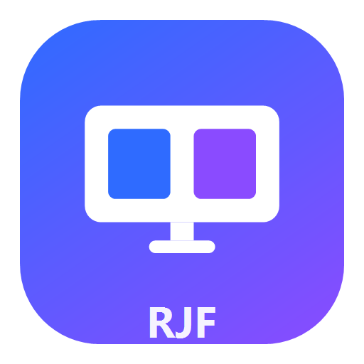
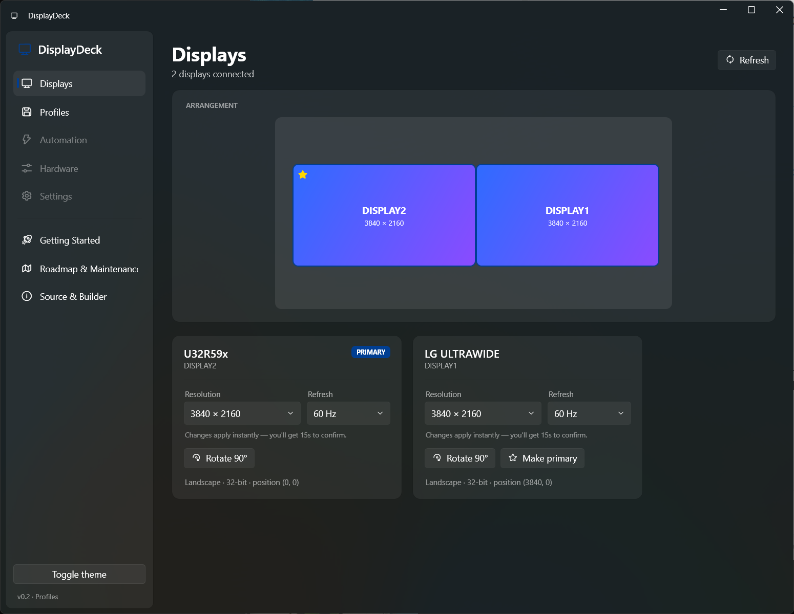
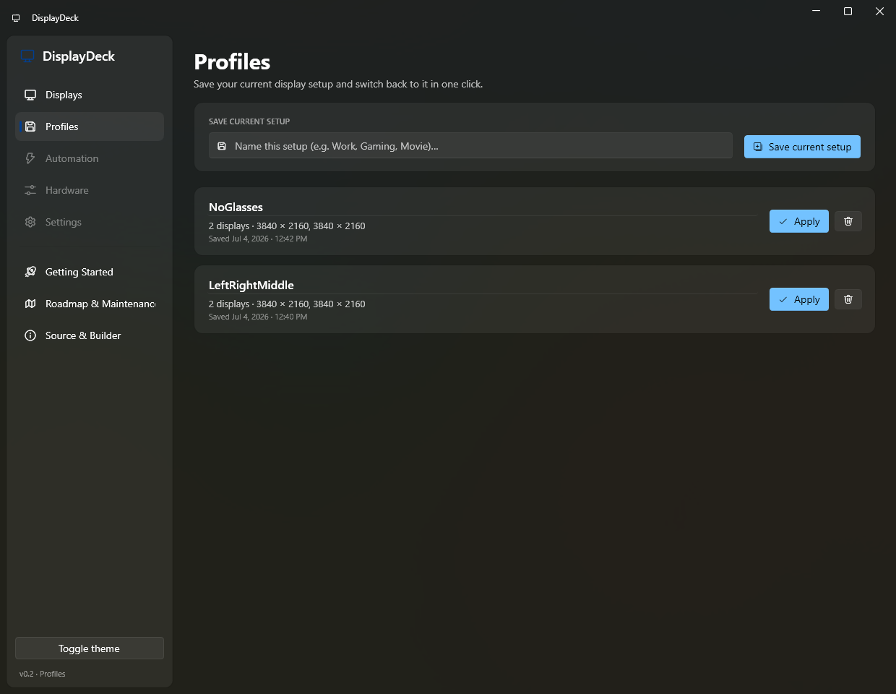

# DisplayDeck



**A fast, modern Windows display switcher.** Change resolution, refresh rate, orientation, and your primary monitor in one place — then save whole multi-monitor layouts as profiles and snap back to them in a single click. Summon it instantly with a global hotkey, and every change is protected by a 15-second auto-revert so a bad mode can never leave you stranded.

[](https://github.com/richfaris/DisplayDeck/actions/workflows/ci.yml)
[](https://github.com/richfaris/DisplayDeck/releases)
[](LICENSE)



## Why

The Windows Settings app is slow to open and clunky for anything beyond a single change. DisplayDeck is built for speed: press `Ctrl + Alt + D`, make your change, and it applies instantly. It lives in the system tray so it's always a keystroke away.

## Features

- **Instant apply** — pick a resolution, refresh rate, or scale and it changes immediately; rotate or set the primary monitor with one button.
- **Per-monitor scaling (DPI)** — choose any scale Windows supports for each display (100%, 125%, 150% …), with the recommended value shown. Saved in profiles too.
- **Drag-to-arrange** — drag monitors on the visual map to reposition them, with edge snapping and the same auto-revert safety net.
- **15-second auto-revert** — every change pops a clear "Keep this change?" dialog with a countdown, so an unsupported mode reverts automatically.
- **Profiles** — save your entire multi-monitor setup (resolution, refresh, color depth, orientation, positions, primary, and per-monitor scaling) as a named preset and apply it in one click.
- **Apply from anywhere** — right-click the tray icon to apply a profile or save the current setup without even opening the window.
- **Global hotkey** — `Ctrl + Alt + D` summons the window centered on your active screen (with automatic fallbacks if that combo is taken).
- **Real monitor names** — resolves friendly EDID names (e.g. "DELL U2723QE") via the Windows CCD API, and matches profiles back to hardware by monitor ID.
- **Fluent design** — a clean, modern WPF UI with light/dark themes and per-monitor DPI awareness.
- **In-app docs** — Getting Started, Roadmap & Maintenance, and Source & Builder pages built right in.

### Profiles



## Install

### Download (no install)

Grab the latest `DisplayDeck-*.exe` from the [**Releases**](https://github.com/richfaris/DisplayDeck/releases) page and run it. It's a self-contained single file — no .NET runtime or installer required.

### winget

```powershell
winget install RichFaris.DisplayDeck
```

### Scoop

```powershell
scoop install https://raw.githubusercontent.com/richfaris/DisplayDeck/main/packaging/scoop/DisplayDeck.json
```

> winget and Scoop pull from a published GitHub Release. If a command reports the package isn't found yet, use the direct download above until the first release is tagged.

## Getting started

> **Quick run from the repo:** double-click **`startup.ps1`** (Run with PowerShell) to launch it — it won't start a second copy if it's already running — and **`shutdown.ps1`** to stop it.
>
> **Start automatically at sign-in:** run **`install-startup.ps1`** once — it adds a Startup-folder shortcut that launches DisplayDeck straight into the tray (`--tray`) on every reboot. Run **`uninstall-startup.ps1`** to undo it.

1. Launch DisplayDeck — it starts in the system tray.
2. Press **`Ctrl + Alt + D`** (or click the tray icon) to open it.
3. On **Displays**, pick a resolution/refresh/scale from a monitor's card, or drag a monitor on the map to rearrange — it applies instantly. Confirm **Keep changes** within 15 seconds.
4. On **Profiles**, name your current arrangement and hit **Save current setup**. Apply it later from the app or the tray menu.
5. Press **Esc** (or the hotkey again) to tuck it back into the tray. Right-click the tray icon → **Exit** to quit fully.

## Build from source

Requires the [.NET 10 SDK](https://dotnet.microsoft.com/download).

```powershell
git clone https://github.com/richfaris/DisplayDeck.git
cd DisplayDeck
dotnet build DisplayDeck.slnx -c Release
```

Produce a self-contained, single-file executable:

```powershell
dotnet publish src/DisplayDeck.App/DisplayDeck.App.csproj -c Release -r win-x64 -p:PublishSingleFile=true -o publish
```

The release pipeline does this automatically — push a version tag (`git tag v0.2.0 && git push origin v0.2.0`) and GitHub Actions builds the exe and attaches it to a Release.

## How it works

- **UI:** .NET 10 WPF with [WPF-UI](https://github.com/lepoco/wpfui) (Fluent theme) and [CommunityToolkit.Mvvm](https://github.com/CommunityToolkit/dotnet).
- **Display control:** Win32 `ChangeDisplaySettingsEx` for applying modes/orientation/primary/positions, and the CCD API (`QueryDisplayConfig` / `DisplayConfigGetDeviceInfo`) for friendly monitor names and per-monitor DPI scaling. All interop lives in `src/DisplayDeck.Core/Interop`.
- **Profiles:** stored as portable `.ddp` JSON files under `%LOCALAPPDATA%\DisplayDeck\Profiles`.

## Roadmap

Shipped, next, and planned items — plus maintenance notes — are documented on the in-app **Roadmap & Maintenance** page. Highlights coming next: per-profile hotkeys, `.ddp` file association, and auto-applying a profile when monitors connect/disconnect.

## Built with

DisplayDeck was designed and built with **[Cursor](https://cursor.com)** (AI pair-programming). The in-app **Source & Builder** page tracks where the source lives and self-updates if the files are moved.

## License

[MIT](LICENSE) © Rich Faris
